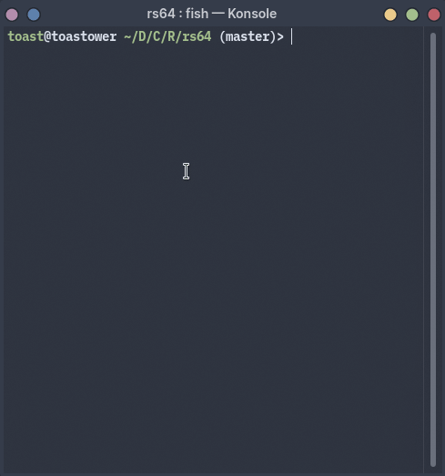

# portfolio

*I do digital art on the side, too!*

## a sampling of programs I've made 

hey! if you're new to my github account, this is a pretty good place to see the sort of stuff I work on. I'll do my best to organize everything and provide screenshots where possible, but don't hesitate to open an issue if you'd like additional details or would like to get in touch.

---

## [qlip](https://github.com/toasterrepairman/qlip)

[Linux] [MacOS] [Windows] [Rust] [Utility]

[ISO/IEC 18004](https://www.iso.org/standard/62021.html)-based program to dump the system clipboard into an ASCII QR code. uses Mozilla's clipboard provider as a backend to ensure cross-platform compatibility. 

## [rgtube](https://github.com/toasterrepairman/rgtube)

[Linux] [Rust] [Utility] [GTK3]

a simple, native youtube-dl GUI written with GTK3.

## [rs64](https://github.com/toasterrepairman/rs64)

[Linux] [MacOS] [Utility] [Rust]

base64 encoding utility with fun colors (non-functional with recent Rust toolchains).

## [boostrap](https://github.com/toasterrepairman/boostrap)

[Linux] [Script] [Bootstrapping]

my personal Arch Linux bootstrapping script. no support is offered, though it is constantly maintained and updated. it's not recommended to run this unless you know what you're doing.

## [sockies](https://github.com/toasterrepairman/sockies)

[Linux] [Backend] [Bootstrapping] [Script]

a highly experimental testbed for orchestrating and bootstrapping podman containers without podman-compose.

## [catboy](https://github.com/toasterrepairman/catboy)

[Linux] [Frontend] [Utility] [Rust] [GTK3]

a text buffer editor with a great name and a handful of useful features.