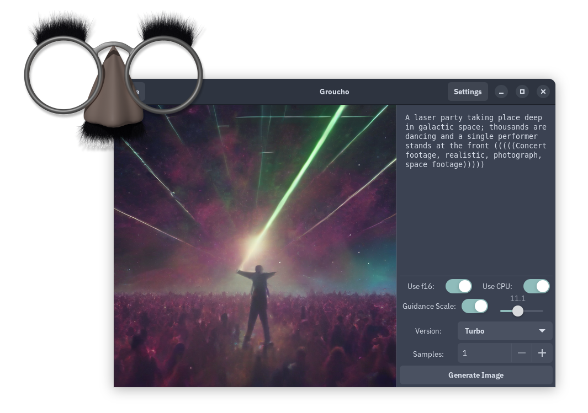

# programming portfolio

---

# frontend work

## [Admiral](https://github.com/toasterrepairman/admiral)

Twitch chat reader with a quality-of-life focus.

## [groucho](https://github.com/toasterrepairman/groucho)

Stable Diffusion interface with support for multiple versions.

## [grimace](https://github.com/toasterrepairman/grimace)

Speech-to-text GUI featuring OpenAI's Whisper model.

## [dipstick](https://github.com/toasterrepairman/dipstick)

A generation viewer for NixOS system versions.

# backend work

## [egghead](https://github.com/toasterrepairman/egghead)

Discord bot connected to a local AI instance. Very unstable, active development.

## [qlip](https://github.com/toasterrepairman/qlip)

[ISO/IEC 18004](https://www.iso.org/standard/62021.html)-based program to dump the system clipboard into an ASCII QR code. Uses Mozilla's clipboard provider as a backend to ensure cross-platform compatibility.

