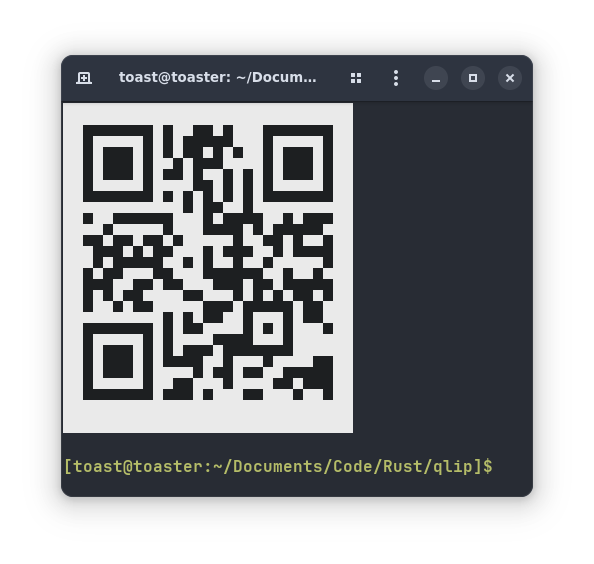

# portfolio

*Shader designed in Blender*

## a sampling of programs I've made 

Hey! If you're new to my github account, this is a pretty good place to see the sort of stuff I work on. I'll do my best to organize everything and provide screenshots where possible, but don't hesitate to open an issue if you'd like additional details or would like to get in touch.

---

## [boostrap](https://github.com/toasterrepairman/boostrap)

[Linux] [Script] [Bootstrapping]

A big collection of dotfiles. Mostly for NixOS, with various outdated scripts for Arch and MacOS

## [grimace](https://github.com/toasterrepairman/grimace)

Speech-to-text GUI featuring OpenAI's Whisper model.

## [rgtube](https://github.com/toasterrepairman/rgtube)

[Linux] [Rust] [Utility] [GTK3]

A simple, native youtube-dl GUI written with GTK3.

## [egghead](https://github.com/toasterrepairman/egghead)

[Rust] [Bot] [Discord] 

Discord bot connected to a local AI instance. Very unstable, active development.

## [qlip](https://github.com/toasterrepairman/qlip)

[Linux] [MacOS] [Windows] [Rust] [Utility]

[ISO/IEC 18004](https://www.iso.org/standard/62021.html)-based program to dump the system clipboard into an ASCII QR code. Uses Mozilla's clipboard provider as a backend to ensure cross-platform compatibility. 
